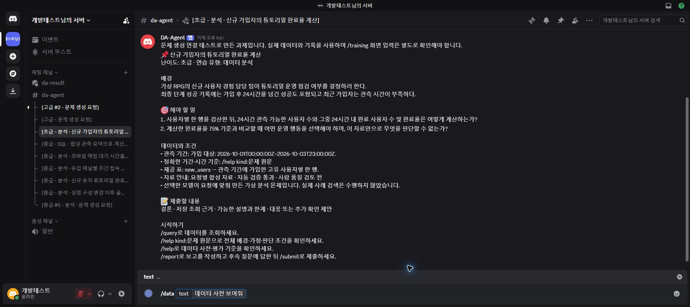
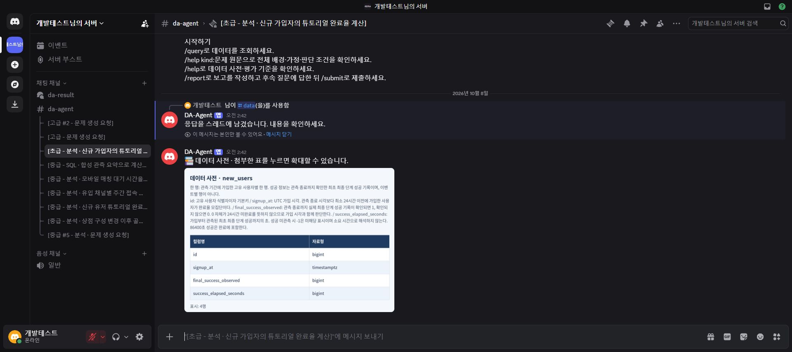

# 자연어 데이터 요청 명령 /data 운영 배포 검증

- 확인일: 2026-10-08 (Asia/Seoul)
- 변경: 실제 기존 명령 `/query`를 `/data`로 변경. 내부 `query` 처리와 저장 기록은 유지.
- 범위: 구현·검증, PR·main CI, 지정된 배포 명령, 서버 등록 목록과 실제 Discord 응답 확인.
- 표준 폴더 구조 7개 모두 존재. 생성·이동 불필요.

## Git과 CI

- [기능 PR #61](https://github.com/skh001218/DA-Agent/pull/61), 기능 커밋 `c28aa011670c498102e3771cd4efdef0c28e9309`.
- PR CI의 `automated-tests`, `discord-db-tests`, `discord-image` 모두 성공.
- main 병합 커밋 `1b61395c3bc7e91f6c55d4a63b2db27d73092a15`, 해당 커밋의 같은 CI 3개 모두 성공.
- [PR CI](https://github.com/skh001218/DA-Agent/actions/runs/37659627845), [main CI](https://github.com/skh001218/DA-Agent/actions/runs/37659833621).
- 로컬 전체 검사: `python -m pytest tests/automated -q` — 850 passed / 96 skipped.
- Discord 회귀: 443 passed / 49 skipped. 실제 SDK 등록·필수 text 옵션·콜백의 기존 query 처리 연결과 모의 응답 전송을 확인했다.
- 생략된 검사는 요구 환경 미설정에 따른 환경 의존 검사이며 통과로 계산하지 않았다.

## 운영 배포

`python scripts/deploy_discord.py --apply`는 진행 중인 출제 요청 때문에 처음에는 중단했다. 요청이 종료된 뒤 같은 명령으로 정확한 main 커밋을 빌드·배포했으며 결과는 `verified`다. CI 또는 유휴 상태 검사를 우회하지 않았다.

`python scripts/deploy_discord.py --status` 확인:

- running: true
- revision: `1b61395c3bc7e91f6c55d4a63b2db27d73092a15`
- source_ref: `refs/heads/main`
- image_id: `sha256:556da4c4ceb6011c57f453e86c49b119864a55ef2bac8642aed86edb8e1a681e`
- files_verified: 88
- llm_provider: codex_cli; daily_call_limit: 30 (배포 전 값 유지)

DB·웹 컨테이너의 ID와 이미지 ID는 배포 전후 동일했다. 로컬 미커밋 파일 덮어쓰기 없이 Git archive로 배포했다. 비밀 설정·배포 기록의 `.local`은 Git에 추가하지 않았다.

## 실제 Discord 확인

1. 운영 봇 자격증명을 출력하지 않고 Discord의 서버 명령 등록 목록을 읽었다. `/data`의 `text` 옵션이 필수이며 `/query`와 `/quary`는 없다. 글로벌 명령 목록은 비어 있다.
2. Chrome에서 `/data` 자동완성과 `text` 입력 옵션을 확인했다.
3. 이전 검증 스레드 `1557274382223540284`는 현재 저장 과제 목록에 없어 `자신의 과제 스레드에서 명령을 사용하세요.` 안내가 나왔다. 해당 스레드의 데이터를 수정하지 않았다.
4. 현재 사용자의 저장된 [분석 과제 스레드](https://discord.com/channels/1556888486919934064/1557374704099139585)에서 `/data text:데이터 사전 보여줘`를 실행했다. 정상 응답과 `new_users` 4개 컬럼의 데이터 사전 PNG를 실제 화면에서 확인했다.
5. 저장 이벤트 `1557447945069133885`는 내부 `query` 행동으로 `completed`가 됐다. 세션 `155ea9cd-de79-418a-a133-83e73785d960`의 `analysis` 상태, 조회 0개, 기존 대기 조건과 질문 ID는 요청 전후 동일했다. 사전 요청으로 모델·SQL을 새로 실행하지 않았다.

이름 변경의 운영 명령 등록·입력·응답 흐름을 확인했다. 이번 검증에서 원본 데이터 SQL 조회를 새로 실행하지는 않았다. 이미 게시된 과거 안내 메시지에는 당시 명령 `/query`가 남아 있으며 새 코드의 안내는 `/data`를 사용한다.

근거: [등록된 명령 목록](../artifacts/data-command-release-2026-10-08/registered-commands.json), [배포와 이벤트 확인](../artifacts/data-command-release-2026-10-08/verification.json).

