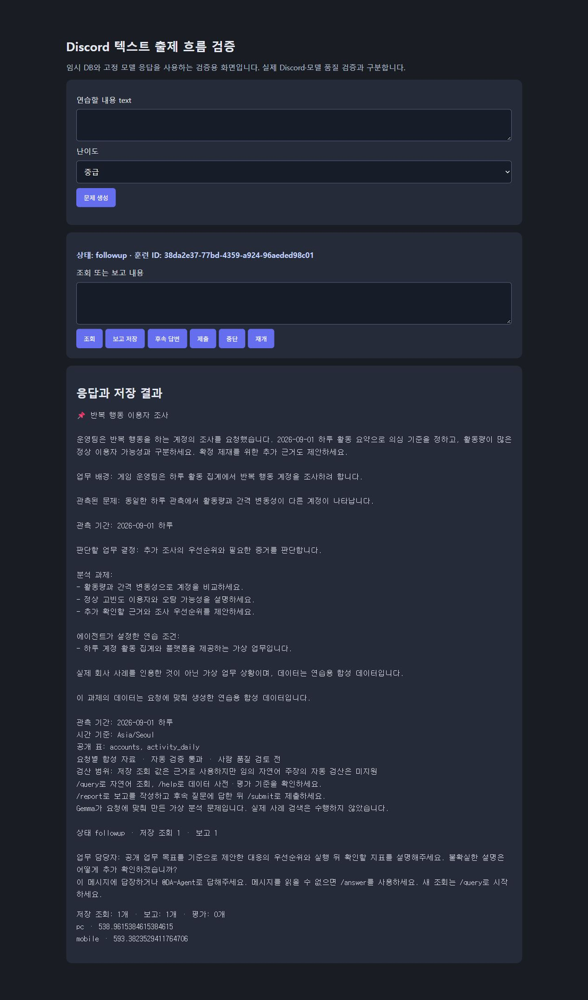

# Discord 출제 설계·수정 요청 개선 검증

> 최초 로컬 수정의 기록이다. 후속 운영 변경과의 통합·실제 배포는 [통합·운영 보고](generation-integration-2026-10-07.md)에 기록했다. 아래 미배포 표시는 당시 상태다.

- 날짜: 2026-10-07 (Asia/Seoul)
- 브랜치: codex/discord-generation-repair-20261007
- 기준: main 5d1d601, 별도 배포 체크아웃·컨테이너를 변경하지 않음
- 결론: 다섯 코드 개선과 로컬 회귀 검증 완료. 실제 Gemma 성공·운영 Discord 반영은 미확인.

## 수정과 근거

| 개선 | 구현 | 검증 |
| --- | --- | --- |
| 실패 초안 누적 제거 | 설계 수정·수동 재시도·적합성 수정에서 최신 초안 하나, 전체 이력은 비공개 checkpoint 보존. Gemma 전송 계층에서도 최신 수정 쌍만 선택 | 연속3회 실패 입력 메시지 수 2→4→4, 비공개 초안3개 보존, 기존 재시도 회귀 |
| 오류별 수정 지시 | 오류 코드·위치·지표와 해당 규칙을 JSON으로 전달. 같은 오류 반복 시 행 단위·지표 구조 재검토 | 잘못된 역방향 조인과 행 수 초과의 서로 다른 피드백, 반복 오류 지시 검증 |
| 관계·행 단위 먼저 설계 | 업무→행 단위/PK/FK→지표 순서 명시, 서버가 허용 FK 방향·파생 group_key 상속·행 단위·유일키를 계산해 수정에 전달 | 역방향 조인 거부와 기존 validator 유지. 사용자 비율1/2와 이벤트 비율2/3을 구분하는 계산 검사 |
| 프롬프트·스키마 정리 | 가상 출제와 웹 검색 프롬프트 분리, 난이도별 지시. schema annotations와 JSON 공백 축소 | required/enum/min/max/필드명 title·description 유지, 웹 검색 프롬프트 회귀 |
| 예산·한도·실패 안내 | 입력/분당 예산 검사 후 실제 전송 직전 callback 차감, 일일/요청 계수와 취소 검사 DB 트랜잭션 공유. 미전송 예약 회수. 실패별 안내·대기 시간·재시도 버튼 구별 | 로컬 초과·429 대기·키 누락·일일 한도·취소 미차감. 전송 시도 후 timeout 차감. DB rollback·한도 도달 상태 유지와 SDK 버튼 검사 |

## 자동 검사

- 최종 전체: **604 passed / 68 skipped**. 생략은 웹/데이터용 DSN 등 별도 환경이 필요한 기존 검사. 이번 변경의 records DB 검사는 실행했다. 기존 FastAPI/httpx 사용에 대한 deprecation warning 1개.
- 격리 DB 전용 실행: **26 passed** (마지막 추가된 SDK/timeout 검사는 최종 전체에서 실행).
- 집중 회귀: **115 passed**, 뒤에 atomic quota와 추가 검사를 포함한 최종 전체로 재확인.
- 실제 PostgreSQL fixture 흐름: 생성→FK 그룹 평균 조회→근거 연결→보고→제출 점수 보류→서비스 재생성 후 복원→학습 계정 쓰기 차단 확인.
- git diff --check 통과.
- 근거: [전체 XML](generation-repair-all-2026-10-07.xml), [DB XML](generation-repair-db-2026-10-07.xml), [집중 XML](generation-repair-targeted-2026-10-07.xml), [DB 통합 결과](../artifacts/generation-repair-db-2026-10-07/integration.json).

## 원래 실패 요청의 오프라인 재구성

운영 기록을 read-only로 읽고 HTTP MockTransport만 사용했다. 외부 모델 호출0, Discord 쓰기0, 비공개 원문 파일 저장0. 원래 초안의 연결 오류를 수치 계산 없이 무시하거나 자동으로 반대로 연결하지 않았다.

| 요청 | 새 코드 추정 입력량 | 한도14,000 대비 여유 | 전달 초안 수 |
| --- | ---: | ---: | ---: |
| 최초 설계 | 5,539 | 8,461 | 0 |
| 첫 수정 | 9,990 | 4,010 | 1 |
| 두 번째 수정 | 10,250 | 3,750 | 1 |

기존 코드로 재구성한 두 초안 누적 입력량은17,426이었다. 실제 API 토큰이 아닌 UTF-8 기반 운영 추정치다. 모델이 관계 오류를 수정하거나 적합성 검토를 통과한다는 증거로 해석하지 않는다. [공개 진단 수치](../artifacts/generation-repair-2026-10-07.json).

재구성: `python scripts/verification/verify_discord_generation_repair.py --session-id f2d9f772-73e5-4670-9dc7-5de156465b59` (현재 운영 기록 읽기만 필요).

## 로컬 화면 확인

`verify_discord_text_generation.py --port 7109 --serve --http-port 8099`의 기존 검증 화면과 고정 모델 응답을 사용했다. 이번 작업에서 생성한 전용 PostgreSQL 컨테이너만 연결했다.

1. 빈 text로 생성: 1~4000자 입력 오류 표시.
2. 중급 요청 입력 후 생성: analysis 상태, 공개 과제·표·조건 표시.
3. 플랫폼별 평균 활동량 조회: 실제 DB 결과 두 행과 저장 조회1개 표시.
4. 보고 저장: followup 상태와 보고1개 표시.
5. 새로고침: 같은 훈련 ID, 조회1개·보고1개·후속 질문 복원.

## 남은 운영 확인

별도 배포 채팅621f의 미커밋 변경에는 난이도·SQL 기능과 일부 입력 예산 개선이 함께 있다. 이 브랜치를 반영할 때 그 변경을 보존하며 provider/generation 공통 수정 부분을 통합해야 한다. 이 작업은 운영 봇을 재시작하거나 기존 실패 요청을 실제 재시도하지 않았다.

운영 반영 뒤 원래 실패 스레드에서 **`/retry`를 한 번 실행**하고 과제 생성 또는 원인별 실패 안내·대기 시간이 나오는지 확인한다. 실제 Gemma와 난이도별 의미 품질은 그 결과로 별도 판단한다. 14,000/65초는 앱의 보수적인 공유 예산이며 실제 서버 한도를 보장하는 수치는 아니다.
