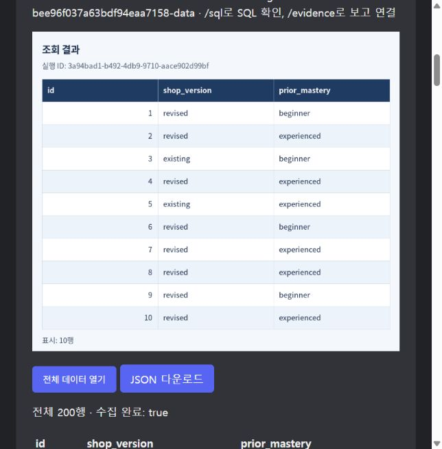

# Spec053 자연어 공개 자료 조회 검증

- 검증일: 2026-10-07 (Asia/Seoul)
- 브랜치: `codex/natural-language-data-query`
- 범위: 구현·자동 회귀·실제 공급자/읽기 전용 DB·로컬 결과 화면 확인. PR·병합·운영 배포 미수행.
- 프로젝트 표준 폴더 7개 모두 존재. 생성·이동 불필요.

## 변경 결과

생성 분석 과제의 모델 입력을 집계 전용 조건에서 현재 공개 자료의 단일 PostgreSQL SELECT로 확장했다. 실행 전에 기존 SQL 정책과 SQLGlot의 공개 스키마 기반 표·컬럼·별칭·CTE 해석을 적용한다. 읽기 전용 역할·트랜잭션, 요청자 소유 세션, 5초·1,000행·1MiB 수집 제한과 저장 근거 검사는 유지한다. 기존 구조화된 집계와 고정 튜토리얼 엔진은 유지한다.

자료 부족은 `missing_data`와 구체적인 정보 목록으로, 계산 미지원은 `unsupported_query`로 구분한다. 자료 부족 안내에는 실제 공개 표·컬럼 목록을 붙이며 SQL은 실행하지 않는다. 공급자 장애 시 답변 보존과 수동 재시도 흐름도 유지한다.

새 SELECT 결과는 첫 10행 PNG 미리보기와 전체 수집 데이터 JSON으로 제공한다. JSON에는 실행 ID, 컬럼, 수집 행, 완전 여부와 확인 가능한 전체 행 수를 담는다. 미완전 결과와 첨부 실패를 전체 데이터 제공 성공으로 표시하지 않는다.

## 자동 회귀

- `python -m pytest -q`: **757 passed, 83 skipped** (14.08초).
- 새 자연어 SELECT/자료 부족/첨부 검사 33개 통과.
- 전체 83개 생략은 별도 DB 등 요구 환경 미설정에 따른 기존 환경 의존 검사다. 생략 검사를 통과로 계산하지 않았다.
- 원본·필터·정렬·여러 평균·산술 비교·표 연결·CTE·UNION·표준편차를 검사했다.
- 비공개 표·컬럼, 다른 스키마, 모호한 컬럼, 변경·여러 문장·잠금·시스템 함수·재귀 SQL·계획 변조는 실행 전에 거절됐다.
- 자료 부족 응답, 잘못된 공급자 응답, 확인 답변의 컨텍스트, 전체 근거 보존, 불완전 JSON, 실제 Gateway PNG/JSON 전송과 실패 대체 안내를 확인했다.

## 실제 모델과 기존 DB

운영 컨테이너를 수정하지 않고 같은 이미지의 별도 일회용 진단 컨테이너에 변경 소스를 연결했다. 운영 볼륨은 읽기 전용으로 연결하고 CLI 홈을 임시 디렉터리에 복사해 운영 캐시·인증 파일 쓰기도 분리했다. `verify_discord_public_query.py`는 사용자 세션과 공개 DB를 읽기 전용으로 읽으며 Discord에 메시지를 게시하지 않는다.

대상: Discord 스레드 `1557274382223540284`, 실제 저장 세션 `644bf048-bf6e-4b7d-99cb-dc75c112d519`. 운영과 동일한 `codex_cli` 공급자를 사용했다.

| 요청 | 확인 결과 |
| --- | --- |
| 상점의 판매 아이템 목록이 이전과 어떻게 달라졌어? | 기존·변경 판매 아이템 목록과 추가·삭제·변경 이력이 없음을 구체적으로 안내; SQL 미실행 |
| shop_profiles의 전체 데이터를 조회해줘 | 200행, 컬럼과 순서까지 독립 SQL과 일치, 완전 수집 |
| 사전 숙련도 beginner 계정의 지정 컬럼을 id 오름차순 조회 | 100행, 독립 SQL과 일치 |
| 상점 구성별 초기·후기 평균 소모와 평균 변화량 | 2행, 독립 SQL과 일치 |

검증 전후 사용자 세션 JSON은 동일했다. 원래 실패 요청·실행 이력은 변경하지 않았다. 증거는 [verification.json](../artifacts/spec053-2026-10-07/verification.json), [전체 데이터](../artifacts/spec053-2026-10-07/full-data.json)에 있다.

## 화면과 다운로드

실제 생성된 응답·PNG·JSON으로 로컬 HTML 미리보기를 열었다. IAB에서 빠진 자료의 안내와 첫 10행 표를 확인하고 `전체 데이터 열기`를 눌러 수집 완료 200행과 헤더 포함 201개 화면 행을 확인했다. `JSON 다운로드`로 내려받은 파일은 저장 JSON과 SHA256이 일치하며 200행을 포함한다. 실제 Gateway 코드의 파일 전송은 가짜 채널을 통해 PNG와 JSON 각각의 바이트를 검사했다.

## 상태와 한계

구현·로컬/실제 모델·DB 검증은 완료했다. 운영 커밋은 `59d8a8c2a6783c1d4bc69215867e6e399b404ddb`이며 이번 변경을 배포하지 않았다. 실제 운영 Discord 명령과 첨부 수신은 이번 검증에서 실행하지 않았다. 운영 반영 후 해당 스레드에서 `/query text:shop_profiles의 전체 데이터를 조회해줘`를 실행해 성공 표와 JSON 첨부를 확인해야 한다.

공개 표·컬럼과 읽기 전용 실행 검증은 SQL의 실행 범위를 확인한다. 모든 자연어의 의미·비교 단위·인과 해석이 정확함을 보장하지는 않는다. 모호한 조건은 확인하고 실제 실행 SQL과 저장 근거를 검토할 수 있다.
