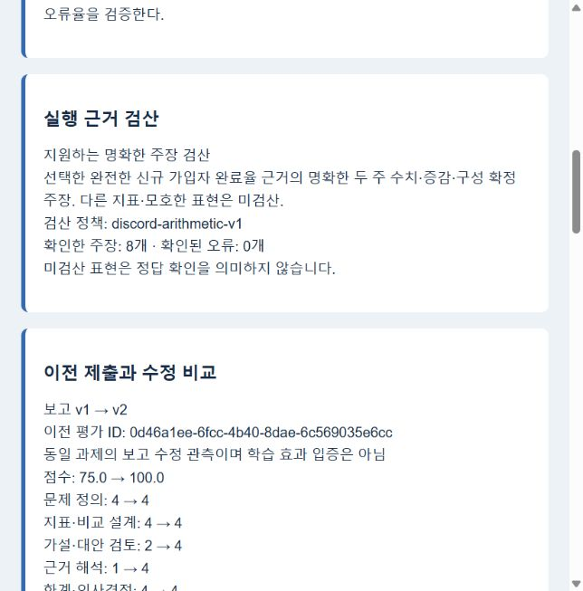

# Spec032 평가 검산과 수정·재제출 검증

- 검증일: 2026-10-06 (Asia/Seoul)
- 대상: 현재 worktree의 Discord 훈련 서비스
- [Spec032](../../specs/032-discord-evaluation-verification-and-resubmission.md)
- 별도 discord_test DB와 검증용 합성 자료를 사용했다. Discord 메시지를 보내지 않았다.

## 구현 확인

| 항목 | 확인 결과 |
| --- | --- |
| 공개 실행 근거 검산 | 선택한 완전한 두 주 신규 가입자 완료율의 분자·분모, 가중 전체 비율, %p·상대 변화율, 1주차 비율 고정 구성 기대값 검산 |
| 잘못된 만점 방지 | 공급자가 전 항목4로 반환해도 확인된 계산 오류는 근거 해석 등급1 상한으로85점. 공급자 원래 판정과 조정 근거 보존 |
| 보수적 판정 | 가설·기각·질문·인용·부정·다른 기준 분해는 확정 오류로 처리하지 않음. 실패/불완전/절단 결과, 0분모, 조건·버전 불일치, 미선택·중복/충돌 근거의 오판 방지 |
| 수정·재제출 | 완료 이후 report로 새 버전·새 후속 질문. 빈 보고와 후속 미답변 제출 거부. 이전 보고·평가 보존 |
| 재평가 자료 분리 | 현재 report를 보고 본문으로 전달. report 명령 메시지와 과거 후속 답변은 평가용 대화에서 제외하되 저장 기록 유지. 동일 시각 저장도 이전 보고 혼입 방지 |
| 비교·복원 | 이전 평가 ID·보고 버전·총점·항목 등급·검산 오류 수 비교, 중복 제출 추가 호출 없음, 재시작 복원 |

## 자동 테스트

- 최종 코드로 Discord 관련 전체 **203개 통과**: [전체 결과 XML](../artifacts/spec032-2026-10-06/discord-tests.xml). DB 테스트용 환경을 모두 지정한 최종 실행에서 생략0건이다. 중간 실행의 DB 환경 미지정 생략 및 임시 폴더에 섞인 별도 PDF 테스트의 수집 오류는 최종 통과 결과와 구분한다.
- 마지막 대화 분리 보완 후 관련 **38개 재통과**: [최종 결과 XML](../artifacts/spec032-2026-10-06/final-focused.xml). 최종 수정은 보고 명령 메시지의 타임스탬프 비교를 제거하고 현재 report를 유일한 보고 본문으로 전달하는 변경이다.
- 기존 실행 이미지의 PDF 소스를 보존한 임시 병합본에서 **25개 통과, 2개 생략, 1개 제외**: [PDF 호환 결과 XML](../artifacts/spec032-2026-10-06/pdf-tests.xml). pypdf 의존 테스트는 생략했고, 이미지에 없는 discord_pdf_evidence 관련 테스트는 제외했다. PDF 전체 검증 완료로 표시하지 않는다.

## 실제 모델·PostgreSQL

[최초 실제 실행](../artifacts/spec032-2026-10-06/live.json)은 Gemma 자연어 조회2회로 두 주 채널별 근거를 저장하고 선택했다. 첫 보고는 ‘1주차 두 채널 모두80%인데 구성만 바꿔 전체70%’라는 틀린 결론을 담았다. 수정 보고는 구성만 바꾸면80%로 유지되며 ads 채널 내 비율 변화도 확인해야 한다고 정정했다.

- 최초 **75점**, 확인된 계산 오류 **2건** → 수정 **100점**, 계산 오류 **0건**.
- 새 후속 답변 전 제출 거부, 이전 보고·평가 불변, 중복 제출 추가 모델 호출 없음, 새 서비스 객체에서 복원 성공.
- 총 모델 호출6회(응답 형식 수정 포함). 이 점수는 해당 보고에 대한 모델 판정이며 학습 효과·제품 품질 승인이 아니다.
- 최초 실행 뒤 추가된 대화 분리와 카드 안내는 자동 테스트·카드 렌더링으로 확인했다. 최초 JSON을 최종 코드의 전체 재실행 결과로 표시하지 않는다.

[PDF 런타임 병합본 추가 실행](../artifacts/spec032-2026-10-06/live-runtime.json)은 최초 **68.75점**, 수정 제출은 **API unavailable로 보류**됐다. 수정 검산 오류는0이고 총점은null이다. 이전 기록·복원도 유지됐다. [추가 호출 기록](../artifacts/spec032-2026-10-06/calls-runtime.json)을 보존했으며 시스템 실패를 학습자0점으로 바꾸지 않았다. 그 이전 시도는 컨테이너 재시작과 함께 중단되어 완료 결과에 포함하지 않았다.

## 화면 확인

실제 저장 결과를 카드 생성 함수로 렌더링한 [미리보기 HTML](../artifacts/spec032-2026-10-06/preview.html)을 로컬 브라우저에서 열었다. v1→v2 전환으로100점, 보고 버전, 항목별 변화, 계산 오류2→0, 수정 안내를 확인했다. 브라우저 오류 로그는0건이었다.

이는 카드 내용의 브라우저 표시 검증이다. 실제 Discord 전송·포럼 게시·PDF 다운로드를 확인한 것으로 표시하지 않는다.

## 한계와 실행 상태

- 자동 검산은 대표 튜토리얼 과제의 명시적 두 주 한국어 수치 주장부터 지원한다. 다른 지표·모호한 표현·2주차 비율을 고정한 분해는 미검산이다. 미검산은 정답 확인이 아니다.
- 자동 점수 조정은 근거 해석 한 항목에만 적용한다. 모델에도 동일 오류 중복 감점 금지를 지시하지만 최초 실행의 가설·대안 항목에도 구성 오류가 감점 이유로 들어갔다. 의미 평가 일관성은 개선 대상이다. 점수 상승만으로 취업 역량 향상을 확정하지 않는다.
- 실행 봇은 다른 worktree의 PDF 이미지(da-agent-discord-bot:pdf-20261006)를 사용한다. 운영 이미지·DB를 이번 코드로 교체하지 않았다. 현재 worktree와 임시 병합본 검증 상태다.
- 배포 뒤 직접 확인할 흐름: 완료 과제에서 report로 수정 → 새 followup 또는 answer → submit → 이전 게시글 보존과 새 결과의 검산·비교 카드 확인.

## 재현 자료

- scripts/verification/verify_discord_revision.py: 별도 discord_test DB와 Gemma 키 파일을 쓰는 실제 모델 흐름. 운영 DB 대상으로 실행하지 않는다. 종료 시 전용 합성 스키마를 정리하고 JSON 결과를 남긴다.
- scripts/verification/render_discord_revision_preview.py: 저장된 live.json을 HTML 카드로 렌더링한다. Discord 전송 없음.
