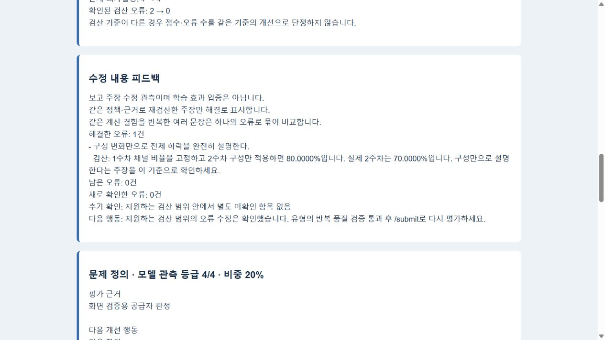

# Spec033 평가 신뢰성 흐름 검증

- 검증일: 2026-10-06 (Asia/Seoul)
- 목적: 사용자가 선택한 엄격한 점수 보류 정책을 구현하고 중복 감점·근거 충돌을 재검증하며, 새 문제 유형에도 같은 절차를 적용한다.
- 범위: 현재 worktree의 Discord 평가 코드·격리 PostgreSQL 서비스·결과 카드 미리보기. 실행 봇 배포와 실제 Discord 전송은 수행하지 않았다.
- 명세: [Spec033](../../specs/033-trustworthy-evaluation-quality-loop.md), [유형 추가 절차](../../docs/evaluation-quality-workflow.md).

## 구현과 자동 검증

PostgreSQL을 포함한 Discord·검산·품질·등록의 최종 회귀 **225개 통과**. 최종 공급자 실패 원인 보존·표시와 보류 안내 수정도 포함한다. Python 컴파일과 변경 diff 공백 검사를 통과했다. [JUnit 결과](../artifacts/spec033-2026-10-06/all-tests.xml)를 보존했다.

| 확인 항목 | 결과와 한계 |
| --- | --- |
| 감점 계약 | 공개 required/core_error ID, 담당 항목, 현재 보고/후속 답변 인용, 성공 실행 참조 검증. 같은 ID 및 ID를 바꾼 같은 오류 중복 감점 차단 |
| 검산 연결 | 확인된 계산 오류는 근거 해석 한 항목에 반영. 다른 항목 사유에 같은 계산 오류를 숨긴 의심 사례도 재검토. 임의 의미 유사성 전체 판별은 지원하지 않음 |
| 제한된 수정 | 형식 보완·품질 수정이 공유하는 최대1회 예산, 영향 없는 등급 유지, 원래/재응답·실패 사유 보존. 재실패는 total=null |
| 유형 점수 보류 | 누락/불일치/미통과 유형은 개별 계약 통과에도 보류·피드백. 같은 보고의 재제출에 추가 모델 호출 없음. 프로필 통과 후 새 평가 이력 생성 |
| 프로필 검증 | 표본·모델·평가 코드 지문 확인. 원본 실행으로 검산, 감점 계약 및 항목 가중 총점을 독립 재계산. 저장 pass 변경·누락·기대 범위 변경 차단 |
| 수정 비교 | 같은 정책/근거의 해결·지속·새 오류·미확인 비교. 주장 삭제는 해결로 인정하지 않음. 다른 데이터/정책은 비교 보류 |
| 등록 지표 | sum/ratio, 공개 조건·단위·컬럼·그룹 검증. 중복 조회를 합산하지 않고 불완전/충돌은 미검산. 잘못된 계약은 문제 정의 보류 |

등록 지표 검산은 명확한 라벨·값·단위 주장만 다룬다. `%p`를 비율`%`로 오해하지 않고 대략·가설·지원 밖 지표는 확정 오류로 만들지 않는다. 새 분야의 문제 출제 기능 자체를 추가한 것은 아니다.

## 실제 카드 화면과 기록 복원

[screen.json](../artifacts/spec033-2026-10-06/screen.json)은 **격리 기록 DB + 검증용 모델 판정 + 기존 저장된 실제 조회 근거**로 만든 서비스 결과다. 이 화면 검증에서 SQL이나 Gemma를 새로 호출한 것은 아니다. 별도 모델 반복 검사와 구분했다.

- 최초 제출에서 유형 프로필 없음으로 점수 보류, 저장 피드백을 같은 보고 재제출에 재사용.
- 오류 보고v1 → 수정 보고v2 → 새 평가. 이전 평가 보존 및 새 서비스 인스턴스의 재개/복원 확인.
- 명확한 잘못된 계산 주장2개 → 수정 후0개. 두 문장이 같은 구성 계산 결함이므로 해결 오류는1개로 표시.
- 수정 후도 유형 검증 미통과이므로 **점수 보류 → 보류**, 등급은 모델 관측으로 표시.
- 브라우저에서 최초/수정 버튼, 새로고침, 개별 계약 통과와 유형 보류의 구분, 오류 해결 및 재평가 안내를 확인. 브라우저 오류 로그 없음.
- 화면에서 발견한 잘못된 안내를 수정: 유형 미통과를 학습자 근거 부족/모델 응답 실패로 표현하지 않고, 오류가 모두 해결되면 남은 오류 수정을 요구하지 않는다.
- 저장된 실제 모델 실패 응답의 최신 코드 재검증으로 [실패 카드](../artifacts/spec033-2026-10-06/failure-preview.html)도 실제 브라우저에서 확인했다. 원래 계약 위반과 보완 호출의 공급자 실패를 함께 표시하고, 공급자 실패로 학습자 근거 부족을 요구하지 않는다. 이것은 추가 모델 호출·Discord 전송 검증이 아니다.

[preview.html](../artifacts/spec033-2026-10-06/preview.html)은 카드 표시 검증 자료이며 실제 Discord 클라이언트/PDF 화면은 아니다.

## 실제 모델 검사 — 이전 중단 회차

[repeated-live.json](../artifacts/spec033-2026-10-06/repeated-live.json)은 `gemma-4-26b-a4b-it`의 실제 응답을 저장한 중단 회차다. 원래 컨테이너가 외부에서 일시정지되어 실행이 중단됐고, 마지막 원본 status=running 스냅샷을 그대로 보존했다. 상태를 completed로 바꾸지 않았다. 최종 코드 해시와 달라 승인 프로필로 사용하지 않는다.

| 표본 | 보존 결과 수 / 계획3 | 진단 후보 점수 | 결과 |
| --- | --- | --- | --- |
| 정상 보고 | 3/3 | 100,100,100 | 관측 범위0 |
| 계산 오류 | 3/3 | API 보류,68.75,65 | API 실패 포함, 성공 점수 범위3.75 |
| 타당한 대안 | 3/3 | 100,100,100 | 관측 범위0 |
| 합리적 판단 보류 | 2/3 | 100,100 | 반복 수 부족 |
| 실행 근거 부족 | 0/3 | — | 미실행 |
| 의도한 시스템 실패 | 0/3 | — | 미실행 |

원시 공급자 호출11개, 반복 결과11개. 요약 verdict=fail, 사람 검토pending. 점수는 검증용 후보 진단이며 학습자에게 제공한 확정 점수가 아니다. 예비 [probe.json](../artifacts/spec033-2026-10-06/probe.json)에서 관측한 API 오류·감점 check 종류 혼동을 보존하고 프롬프트/다음 연습 기본 안내를 수정했다.

## 저장된 실제 반복 검사와 최신 코드 재검증

운영 봇을 변경하지 않고 별도 검증 컨테이너에서 고정 코드·표본으로 전체 여섯 표본×세 번을 완료했다. [final-pinned.json](../artifacts/spec033-2026-10-06/final-pinned.json): status=completed, 결과18개, 실제 모델 호출20회(기본15회+보완5회), 공급자 API 오류6회, 자동 품질fail, 등록held. 실패 아카이브1개·활성 profile.json **0개**를 확인했다. 시스템 실패3개는 의도한 공급자 장애 주입이며 실제 외부 모델 호출이 아니다.

| 표본 | 결과 / 계획3 | 성공한 진단 후보 점수 | 예상하지 않은 보류 | 판정 |
| --- | --- | --- | --- | --- |
| 정상 보고 | 3/3 | 100,100 | 1 | API 실패 포함, 미통과 |
| 계산 오류 | 3/3 | 없음 | 3 | 누락 개선 안내 및 보완 API 실패, 미통과 |
| 타당한 대안 | 3/3 | 100,100,100 | 0 | 이 표본 자동 조건 통과 |
| 합리적 판단 보류 | 3/3 | 100,100 | 1 | API 실패 포함, 미통과 |
| 실행 근거 부족 | 3/3 | 5 | 2 | API 실패·감점 참조 계약 재실패, 관측 부족 |
| 의도한 시스템 실패 | 3/3 | 없음 | 0 (예상 보류3) | 총점null 조건 통과 |

전체 실제 모델 평가15개 중 계약 통과8개, 보류7개다. 보완5회 중1회 재검증 성공·4회 실패이며 보완은 평가당 최대1회다. API 오류는 api_unavailable3회·api_rate_limited3회였다. 오류 표본의 모델 원응답에 같은 계산 결함을 가설/근거 해석에 함께 감점하는 사례와 개선 안내 누락이 남았다. 형식 보완에서 등급을 임의로 높이지 않으며, 추가 수정 예산 없이 점수 보류로 끝냈다. 근거 부족 표본에서는 감점의 report:1을 해당 항목 참조 목록에 넣지 않는 문제가 재검토 후에도 남은 사례를 보존했다.

표본은 **고급·baseline 튜토리얼** 문제 정의다. 다른 난이도·변형·새 분야를 승인하는 자료로 재사용하지 않는다. 실행 중 발견한 보완 호출 실패의 원인 보존과 카드 안내를 수정했으므로 실제 원시 회차의 코드 해시와 최종 코드 해시도 구분한다. 최신 코드로 저장된 응답을 재검증하는 자료는 recorded_revalidation이며 승인 프로필로 등록하지 않는다.

[replayed-final.json](../artifacts/spec033-2026-10-06/replayed-final.json)은 추가 API 호출 없이18개 저장 결과를 최신 코드로 재검증했다. 후보 점수/통과·보류 구성은 동일하고, 보완 공급자 오류의 원인 보존을 확인했다. original_code_hashes·현재 code_hashes와 원래 상태를 모두 저장했고, gate=held다. 이 재검증을 최종 코드의 새 실제 반복 검사로 세지 않는다.

**결론: 신뢰성 검증·보류 기능의 동작은 확인했지만 현재 유형의 점수 제공은 승인하지 않았다.** 후보 점수를 학습자 확정 점수로 표시하지 않는다. 개별 응답과 유형 반복 검증을 함께 통과해야 새 점수 제공이 가능하다.

## 다음 개선 우선순위

1. API 응답 불가/호출 제한을 안정화한 환경에서 동일 고정 표본을 전체 재검사한다. 성공 응답만 선별하거나 기대 범위를 사후 확대하지 않는다.
2. 모델 원응답의 개선 안내 누락·감점 참조 목록 불일치와 같은 계산 결함의 여러 항목 감점을 줄인다. 변경 시 원래 실패 표본을 보존하고 계약·코드/모델 버전 기준으로 재검증한다.
3. 고급 표본의 자동 조건과 사람 검토가 확보되면 초급·중급·변형별 독립 표본을 검증한다. 새 분야는 공개 지표 계약·독립 SQL 기대값·표본을 준비해 같은 절차를 적용한다.
4. 실행 봇에 반영 후 실제 Discord 게시/PDF·재제출 전달을 확인한다. 취업 준비 효용은 실제 참가자의 보고 수정과 다른 문제 적용으로 별도 확인한다.

## 환경과 남은 작업

- 표준 폴더7개 존재 확인, 파일 이동/삭제 없음.
- 외부에서 일시정지된 기존 PDF 봇을 재시작하거나 배포하지 않았다. 사용자 운영 기록·DB 볼륨을 초기화하지 않았다.
- 테스트용 helper/미리보기 서버만 작업 종료 시 정리한다. 기존 봇에는 Discord 메시지를 보내지 않았다.
- 전 유형의 의미적 품질, 새 주제 출제 연결, 실제 Discord/PDF 전달, 사람이 검토한 취업 준비 효용과 학습 효과는 남아 있다.

## 사용자가 직접 확인할 행동

현재 코드를 실행 봇에 반영한 뒤 `/submit` 결과에서 **문제 유형 반복 검증: 미통과 · 점수 보류**와 분석 피드백이 함께 표시되는지 확인한다. 배포 전에는 기존 실행 봇에 이 변경이 적용됐다고 해석하지 않는다.

## 후속 검토: 개선 미완료와 추가 누락 (2026-10-06)

사용자는 추가 개선과 이전 개선의 미완료 여부를 요청했다. 코드와 위 원시 결과를 다시 검토했으며, 이번에는 제품 코드를 수정하거나 새 모델/API 호출을 하지 않았다. 이전225개 통과를 새로운 검증 결과로 세지 않는다.

### 추가로 재현한 유형 승인 재사용 누락

evaluate_report는 accepted_limits·valid_paths·quality_information을 공개 평가 입력으로 전달하지만 evaluation_registry.task_key는 이3개를 포함하지 않는다. 각 필드의 설명을 바꾸고 기존/변경 task_key를 비교했을 때3개 모두 동일했다. [읽기 전용 재현 기록](../artifacts/spec033-2026-10-06/followup-review.json)을 저장했다. 승인 프로필이 있다면 변경된 공개 풀이/한계 조건에 이전 승인을 재사용할 가능성이 있다. 현재 활성 승인 프로필0개이므로 실제 잘못된 점수가 제공됐다는 관측은 아니다.

추천: 평가용 공개 과제 추출과 프로필 지문 계산을 하나의 공통 함수로 묶고, 평가에 전달하는 모든 의미 있는 공개 정의가 바뀌면 재검증을 요구한다. 각 필드 변경의 무효화 테스트를 추가한다. 이 누락으로 Spec033 반복 품질 검사 작업을 재개방해5/6으로 갱신했다.

### 이전 개선의 남은 항목

- 중복 감점 차단/보류는 구현했으나 실제 모델의 중복 감점 생성은 남았다. 형식/참조 누락도 재검토 후 실패한 결과가 있다.
- 현재 형식 검사는 첫 위반에서 종료하고, 보완은 모든 등급을 고정한다. 한 응답에 형식 누락과 중복 감점이 함께 있으면 한 번의 형식 보완으로 수정 예산을 쓰고 의미 수정이 제한된다. 추천은 수정 전에 검사 가능한 위반을 모아 한 번의 재검토에 전달하고, 영향 없는 등급만 고정하는 통합 검사다. 수정 예산을 늘리거나 근거 없이 점수를 높이는 방향은 아니다.
- 감점 참조 ID를 항목 참조 목록에 다시 써야 하는 중복 표현이 실제 불일치로 이어졌다. 추천은 검증된 감점 근거를 기준으로 항목 참조를 코드에서 구성하고 허위/실패 실행 참조 검사를 유지하는 구조다.
- 대안·판단 보류 표본은 정상 보고에 문장을 덧붙인 형태다. 독립적인 다른 분해, 핵심 데이터 부족, 문체 차이·부분 수정·새 오류 등으로 표본을 확대해야 한다. 현재 통과로 모든 타당한 대안을 인정한다고 일반화하지 않는다.
- 대표 과제의 초급/고급 공개 rubric이 동일함을 이번 읽기 전용 재현에서도 확인했다. 난이도별 분석 행동·통과 조건·3/4등급 예시를 분리하는 이전 제안은 여전히 남았다.
- 산술 수정 비교는 구현했으나 일반적인 가설·의사결정의 의미 오류 해결까지 독립 검증하지 않는다. 검산 밖 판단과 사람 검토, 실사용 학습 효용은 남아 있다.

추천 순서: 공개 정의 승인 무효화 누락 수정 → 형식/감점 통합 재검토 및 참조 구조 개선 → API 조건 확인/안정화 후 동일 표본 반복 → 독립 표본 확대 및 난이도 기준 분리 → 실제 Discord 전달/사람 검토 → 요청 주제 확장.
